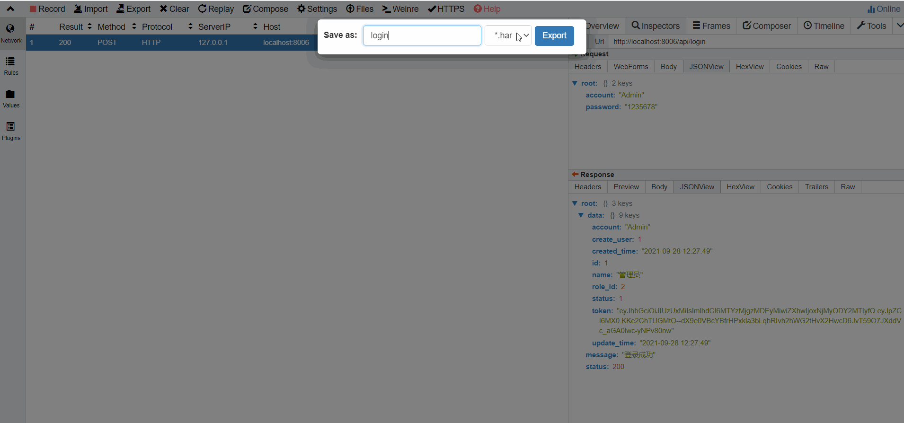
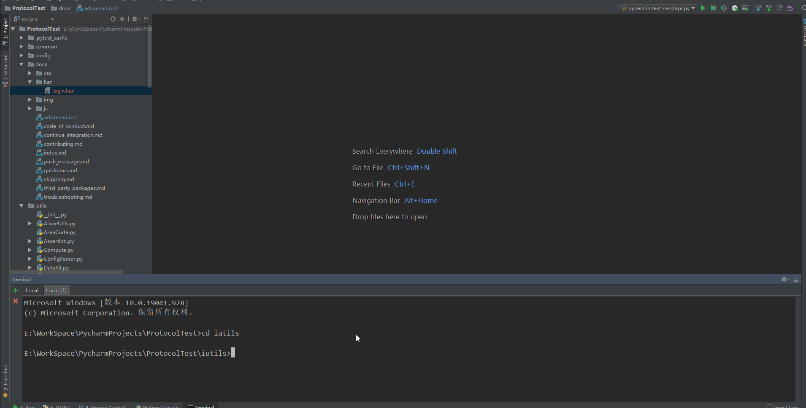

# 快速入门

!!! summary "发送简单的不同类型的数据请求 有部分需要content_type 后续案例会提到"
```pycon
>>> from iutils.OkHttps import Httpx
>>> data,json,params={'key': 'value'}
>>> Httpx.sendApi('https://httpbin.org/get','get')
>>> Httpx.sendApi(url='https://httpbin.org/get', method='get')
>>> Httpx.sendApi(url='https://httpbin.org/put', method='put', data,json,params)
>>> Httpx.sendApi(url='https://httpbin.org/post', method='post', data,json,params)
>>> Httpx.sendApi(url='https://httpbin.org/head', method='head')
>>> Httpx.sendApi(url='https://httpbin.org/patch', method='patch')
>>> Httpx.sendApi(url='https://httpbin.org/delete', method='delete')
>>> Httpx.sendApi(url='https://httpbin.org/options', method='options')
```

!!! summary "请求中包含查询参数，可使用params参数"

```pycon
>>> params = {'key1': 'value1', 'key2': 'value2'}
>>> Httpx.sendApi(url='https://httpbin.org/get', method='get', params=params)
```

!!! summary "content_type = x-www-form-urlencoded，可使用data参数"

```pycon
1. 仅声明method、url、请求参数 （复杂条件非post请求时不靠谱）
该方式会根据data/json/params值是否传入对应填补norm_headers中默认三种headers
>>> data = {'key1': 'value1', 'key2': 'value2'}
>>> Httpx.sendApi(url='https://httpbin.org/post', method='post', data=data)

2. 不仅声明method、url、请求参数，还外加content_type （标准推荐使用）
>>> data = {'key1': 'value1', 'key2': 'value2'}
>>> headers = {"content-type": "application/x-www-form-urlencoded"}
>>> Httpx.sendApi(url='https://httpbin.org/post', method='post', headers=headers, data=data)
```

!!! summary "content_type = application/json;charset=UTF-8，可使用data 或 json 参数"
```pycon
1. 仅声明method、url、请求参数 （复杂条件非post请求时不靠谱）
该方式会根据data/json/params值是否传入对应填补norm_headers中默认三种headers
>>> json = {'key1': 'value1', 'key2': 'value2'}
>>> Httpx.sendApi(url='https://httpbin.org/post', method='post', json=json)

2. 不仅声明method、url、请求参数，还外加content_type （标准推荐使用）
>>> json = {'key1': 'value1', 'key2': 'value2'}
>>> headers = {"content-type": "application/json;charset=UTF-8"}
>>> Httpx.sendApi(url='https://httpbin.org/post', method='post', headers=headers, json=json)
```

!!! warning "content_type是None且非post请求时默认使用get_headers模板 也可完善iutils/OkHttps.py:270~280 line"

```
if json is not None and content_type is None:
    headers.update(self.headers["json_headers"])
elif params is not None and content_type is None:
    headers.update(self.headers["get_headers"])
elif data is not None and content_type is None:
    headers.update(self.headers["from_headers"])
    if method == "get":
        data = parse.urlencode(data)
elif method == "get" and content_type is None:
    headers.update(self.headers["get_headers"])
elif method == "post" and content_type is None and json is not None:
    headers.update(self.headers["json_headers"])
elif method == "post" and content_type is None and data is not None:
    headers.update(self.headers["from_headers"])
    if method == "get":
        data = parse.urlencode(data)
elif content_type is not None:
    headers.update(self.headers["get_headers"])
```

!!! danger "获取响应结果 你可以用下面几组函数"

```pycon
def getCookies(self, response, keyword):获取cookies
def getUrl(self, response):获取请求地址
def getStatusCode(self, response):获取返回的状态码
def getResponseTime(self, response):获取响应执行时间,单位s
def getEncoding(self, response):获取编码
def getHttpxd(self, response):获取请求方式
def getText(self, response):获取返回的text结果
def getContent(self, response):    获取Content
def getRaw(self, response): 获取返回的raw结果
def getReason(self, response):获取请求状态
def getHeaders(self, response): 获取headers
def getNotice 根据穿过来的status_code返回相应的文案
等同于request原生的
.url
.text
.json()
.headers
.content
.cookies
.status_code
.apparent_encoding
..............
```

!!! danger "快速写一个Pytest用例 注意用例函数及扫描路径与pytest.ini保持一致"

```
pytest.ini -->
[pytest] 
testpaths = testings
python_files =test_*.py
python_classes =Test*
python_functions =test

testings -->
import pytest
from iutils.OkHttps import Httpx

class TestSendApi():
    def test_request_001(self):
        response = Httpx.sendApi(method="get", url="http://localhost:8001/#network")
        req_code = Httpx.getStatusCode(response)
        print("{}".format((ResponseCode, "*" * 15, req_code)))
        assert req_code == "error"

if __name__ == '__main__':
    pytest.main(["-s","TestSendApi::test_request_001"])
    
usefixtures.py ('ResponseCode', '***************', [200, 'OK：请求已正常处理'])
F
        with assume:
>           assert req_code == "error"
E           pytest_assume.plugin.FailedAssumption: 
E           1 Failed Assumptions:
E           
E           usefixtures.py:30: AssumptionFailure
E           >>	assert req_encoding == "error"
E           AssertionError: assert 200 == 'error'

usefixtures.py:13: FailedAssumption
=========================== short test summary info ===========================
FAILED usefixtures.py::TestSendApi::test_request_001 - pytest_assume.plugin.F...
============================== 1 failed in 0.52s ==============================

```
!!! warning "如果你是需要效验多个值的情况可使用上下文管理 （有缺陷，若上一个挂了 后面不会执行）"
```
import pytest
from iutils.OkHttps import Httpx
from pytest_assume.plugin import assume

class TestSendApi():
    def test_request_001(self):
        response = Httpx.sendApi(method="get", url="http://localhost:8001/#network")
        req_code = Httpx.getStatusCode(response)
        req_text = Httpx.getText(response)
        ........
        with assume:
            assert req_code == "error"
            assert req_text == "error"
            assert req_content == "error"
            assert req_headers == "error"
            assert req_encoding == "error"
            ..........

if __name__ == '__main__':
    pytest.main(["-s","TestSendApi::test_request_001"])

运行结果：
>           assert req_code == "error"
E           pytest_assume.plugin.FailedAssumption: 
E           1 Failed Assumptions:
E           
E           usefixtures.py:30: AssumptionFailure
E           >>	assert req_encoding == "error"
E           AssertionError: assert 200 == 'error'

usefixtures.py:26: FailedAssumption
=========================== short test summary info ===========================
FAILED usefixtures.py::TestSendApi::test_request_001 - pytest_assume.plugin.F...
============================== 1 failed in 0.51s ==============================
```

!!! success "也可以使用无上下文的assume 若中间有效验挂了，后面还有程序则会再执行下去"

```
import pytest
from iutils.OkHttps import Httpx

class TestSendApi():
    def test_request_001(self):
        response = Httpx.sendApi(method="get", url="http://localhost:8001/#network")
        req_code = Httpx.getStatusCode(response)
        req_text = Httpx.getText(response)
        req_headers = Httpx.getHeaders(response)
        req_encoding = Httpx.getEncoding(response)
        req_httpxd = Httpx.getHttpxd(response)  # 获取请求方式，实际没有意义
        req_timeout = Httpx.getResponseTime(response)
        req_content = Httpx.getContent(response)
        req_datas = {"ResponseCode": [req_code, Httpx.getNotice(req_code)], "ResponseTime": req_timeout,
                     "ResponseEncoding": req_encoding, "ResponseHeaders": req_headers, "ResponseText": req_text}

        for key, value in req_datas.items():
            print("{}".format((key, "*" * 15, value)))
        pytest.assume(req_code == "error")
        pytest.assume(req_text == "error")
        pytest.assume(req_content == "error")
        pytest.assume(req_headers == "error")
        pytest.assume(req_encoding == "error")

if __name__ == '__main__':
    pytest.main(["-s","TestSendApi::test_request_001"])

运行结果如下：
    def reraise(tp, value, tb=None):
        try:
            if value is None:
                value = tp()
            if value.__traceback__ is not tb:
>               raise value.with_traceback(tb)
E               pytest_assume.plugin.FailedAssumption: 
E               5 Failed Assumptions:
E               
E               usefixtures.py:24: AssumptionFailure
E               >>	pytest.assume(req_code == "error")
E               AssertionError: assert False
E               
E               usefixtures.py:25: AssumptionFailure
E               >>	pytest.assume(req_text == "error")
E               AssertionError: assert False
E               
E               usefixtures.py:26: AssumptionFailure
E               >>	pytest.assume(req_content == "error")
E               AssertionError: assert False
E               
E               usefixtures.py:27: AssumptionFailure
E               >>	pytest.assume(req_headers == "error")
E               AssertionError: assert False
E               
E               usefixtures.py:28: AssumptionFailure
E               >>	pytest.assume(req_encoding == "error")
E               AssertionError: assert False
```

!!! warning "若你想在Allure报告中打标签可以使用Func:setTag"
```shell
def setTag(data):
    """
    设置allure标签
    :param severity:  优先级
    :param epic:      史诗级
    :param feature:   一级标签 用于描述被测试产品需求
    :param story:     二级标签 用于描述feature的用户场景，即测试需求
    :param title:     标题 用于描述用例名称
    :param description:  备注信息
    """
from iutils.AllureUtils import setTag
setTag({'feature':'用于描述被测试产品需求','story': '用于描述feature的用户场景','title':'用于描述用例名称'})

```

!!! note "如果你需要在纯Py里加入参数化，那么可以了解Helper、OkHttps中的Class及Func"
```shell
iutils/Helper.py citeHelper/combData 参数化
iutils/OkHttps.py:100 line saveData  提取Response中参数
注意：手动跟自动模式下使用变量的方式会有所差异

randInt(min_=1, max_=100) 随机生成整数
randFloat(min=0, max=1, length=2) 随机生成浮点数
randTime(layout) 随机生成时间
randComputeTime 随机生成偏移时间
randLetters(length=10) 随机生成字母
randSample(elements=default_elements) 随机生成字符（英文+数字）
randNumber() 随机生成手机号
randName() 随机生成名字
randAddress() 随机生成所在地址
randCountry() 随机生成国家名
randCountryCode() 随机生成国家代码
randCityName() 随机生成城市名
randCity()  随机生成城市
randProvince() 随机生成省份
randEmail() 随机生成email 
randIpv4() 随机生成IPV4地址
randLipate() 随机生成车牌号
randColor() 随机生成颜色
randSafeHexColor() 随机生成16进制的颜色
randColorName() 随机生成颜色名字
randCompanyName() 随机生成公司名
randJob() 随机生成工作岗位
randPwd() 随机生成密码
randUuid4() 随机生成uuid
randSha1() 随机生成sha1
randMd5() 随机生成md5
randFemale() 随机生成女性名字
randMale() 随机生成男性名字
randUserInfo() 随机生成粗略的基本信息
randUserInfoPro() 随机生成详细的基本信息
randUserAgent() 随机生成浏览器头user_agent
randIdCard() 随机生成身份证
getUserVars(var) 获取自定义全局变量
getExtractVars(global) 获取提取前一个response返回值写入的参数
```

!!! failure "生成即拿即用的动态单个参数 （缺陷每次都得定义 不建议）"
```shell
结构体：method = rand/get、*args 参数
    print(citeHelper('${method(*args)}')) 
    print(citeHelper('$ENC_(method,Base64参数加密)')) 
案例：
    print("${randInt}-->",citeHelper('${randInt}'))
    print("${randMale}-->",citeHelper('${randMale}'))
    print("${randLetters(5)}-->",citeHelper('${randLetters(5)}'))
    print("${randSample(123567890,30)}-->",citeHelper('${randSample(123567890,30)}'))
    
    输出结果：
    ${randInt}--> 82
    ${randMale}--> 陆梅
    ${randLetters(5)}--> CNljJ
    ${randSample(123567890,30)}--> 891906121867800673531018118931
```

!!! success "固定yaml文档存储动态函数来创建公共单个变量 （推荐）"
```shell
结构体：与即拿即用的方式一致、唯一区别就是用yaml存了起来
自动扫描的文件：testings/config/properties/user_vars.yaml (可修改文件或改成路径扫描)
Int: ${randInt}
Float: ${randFloat(10,5,2)}
Time: ${randTime(10timestamp)}
ComputeTime: ${randComputeTime()}
Custom_INT_VAR: 12356789
Custom_STR_VAR: 12356789ABCDEFG
Custom_None_VAR: NONE
Custom_NULL_VAR: null

# 获取user_vars.yaml全部内容 return dict类型数据
print(citeHelper("${getUserVars()}"))

# 获取单个值 也可以写成 citeHelper("{{Int}}")
print(citeHelper("${getUserVars(Int)}")) 

# 需要注意的是当值不存在时默认为None，例如：
1. user_vars.yaml 文档是空的 print(citeHelper("${getUserVars()}")) --> None
2. user_vars.yaml 文档非空 但是对应的key不存在 print(citeHelper("${getUserVars("Can't find")}")) --> None
```

!!! warning "纯Py脚本的动态请求参数只需调用Helper.combData包即可"

```shell
from iutils.Helper import combData
parameter1 =  {"Int": "{{Int}}","ComputeTime": "{{ComputeTime}}","Letters": "{{Letters}}","Sample": "{{Sample}}"}
parameter2 = {"Int": "${randInt}","ComputeTime": "${randTime(10timestamp)}","Letters": "${randLetters}","Sample": "${randSample}"}
parameter3 = {"md5": "$ENC_(md5,Md5参数加密)"}
parameter5 = {"sha1": "$ENC_(sha1,Sha1参数加密)"}
parameter6 = {"base64": "$ENC_(base64,Base64参数加密)"}
for index in range(5):
    if index == 3:
        continue
    else:
        got = ""
        exec("got = combData(parameter{})".format(index+1))
        print("parameter{}".format(index+1),got)
Got:
    parameter1 {'Int': 97, 'ComputeTime': '2021-09-28 19:01:55', 'Letters': 'MaVQuEZXAs', 'Sample': 'dvHru77pFq'}
    parameter2 {'Int': 37, 'ComputeTime': '1632826905', 'Letters': 'nhhJQvxYeN', 'Sample': 'xIDwh4aDiS'}
    parameter3 {'md5': '9eac9e70904d518e1ea593526e1ffb7a'}
    parameter5 {'sha1': 'ad19630d225712cecf3c9d9b287130bd35a10eb5'}
    parameter6 {'base64': 'QmFzZTY05Y+C5pWw5Yqg5a+G'}

```
!!! tip "将Har包转为简单自动化用例"
	
	1. 导出数据包为.Har文件，例如：[login.md](code/login.md)
	2. 调用HarToData.py转成Yaml版[标准的Case](code/yaml_config.md)，例如：[login.yaml](code/login_yaml.md),[login.json](code/login_json.md)
	



!!! danger "一个简单的Yaml用例，对比纯Py用例[login.py](code/test_login.md)"

```pycon
# 结合[login.yaml](har/login_yaml.md)
1. 将转化好的yaml版case移动到testings/test_yaml文件夹下 （必须）
2. 编写用例
config:
- headers: （改成标准的）
    accept: application/json, text/plain, */*
    accept-encoding: gzip
    accept-language: zh-CN,zh;q=0.9
    content-type: application/json;charset=UTF-8
    user-agent: Mozilla/5.0 (Windows NT 10.0; Win64; x64) AppleWebKit/537.36 (KHTML,
      like Gecko) Chrome/93.0.4577.82 Safari/537.36
- allures:
    description: 这个一个最简单的全自动用例 （全局会用 可选）
    feature: 登录模块
    severity: blocker # 给定一个优先级 变化点
- request: （原封不动）
    method: POST
    url: http://localhost:8005/api/login
test_setup:
  apilogin:
    request:
      json: {"account": "Admin","password": "1235678"} （还可以跟data/params）
    allures:
      story: 使用正确管理员账号登录
      title: 登录成功
    validations:
      expected_code: 200
	  
3. 创建一个测试py文件
import pytest
from iutils.OkHttps import Httpx
from testings.control.init import Envision

config = Envision.getYaml("login.yaml")['config']
test_setup = Envision.getYaml("login.yaml")['test_setup']

class TestSendApi():
    def test_request_001(self):
        Httpx.sendApi(auto=True,esdata=[config,test_setup["apilogin"]])

if __name__ == '__main__':
    pytest.main(["-s","TestLogin::test_request_001"])
```

!!! question "若简单的请求能流畅的上手 建议了解[高级用法](advanced.md)"

    1. 多维度场景下仅少量py代码、case全都由Yaml文档维护
    
    2. 支持动态参数化、多类型参数值效验，可提取前一个接口response中Json回参值、并在下级case中调用、使上下级case共生使用
    
    3. 用例失败重跑&跳过可以阅读Pytest[官方文档](skipping.md)